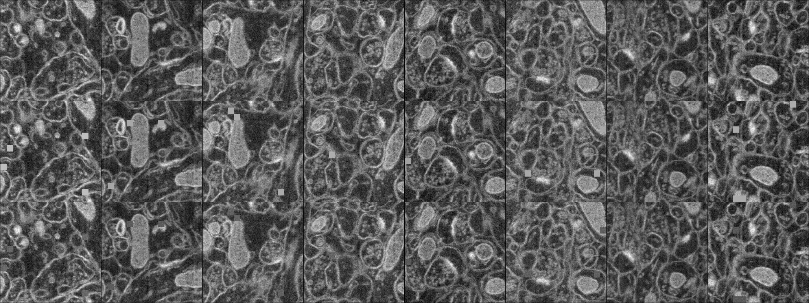

### Large-scale distributed training of 3D masked autoencoder (MAE) models
This repository can be used to train large-scale 3D masked autoencoder (MAE) models on volume EM data. This repository is currently being developed and tested on **Arch**, an HPE Cray EX254n supercomputer that has a total of 168 GH200 superchips (42 nodes x 4 GH200s; each GH200 has 96GB HBM3 high-bandwidth GPU memory).

The skeleton of the training code here is based on the [`torchtitan`](https://github.com/pytorch/torchtitan) library, although the model definition, data loading, and parallelization components are substantially rewritten. The code currently supports **FSDP** (fully sharded data parallelism), **TP** (tensor parallelism), and **PP** (pipeline parallelism), but based on preliminary experiments, I don't think we will need anything beyond FSDP (at least not on Arch, on Frontier TP might be needed as well, but I haven't tried this on Frontier yet).

### Model
I implemented an extremely generic 3D MAE model with an encoder and a decoder (both generic transformer models). For a refresher on MAEs, please see, *e.g.*, [the original MAE paper](https://arxiv.org/abs/2111.06377). The model architecture is defined [here](torchtitan/models/llama/model.py) and the default model configuration I'm working with is a **~2B** parameter model that uses a 16-layer ViT encoder with a dimensionality of 3072 and a 4-layer ViT decoder with a dimensionality of 512. The model uses (8, 8, 8) patches. To impart positional information to the patches (or tokens), I currently use separate RoPE embeddings for the encoder and the decoder. I'm not sure if this choice is optimal. We should also definitely try learnable position embeddings later on.

### Data
For purposes of development and testing, I only downloaded two EM volumes from [OpenOrganelle](https://www.openorganelle.com/datasets): `jrc_cos7-1a` and `jrc_mus-hippocampus-3`. The data loading logic is implemented [here](torchtitan/datasets/datasets.py). Currently, I'm just taking random crops of size (512, 512, 512) from one of the available volumes at the highest resolution (`s0`) and I don't apply any spatial transformations. I've found that anything that involves doing an interpolation on a `zarr` array imposes a huge bottleneck in data loading times (*e.g.* data loading times increase by almost 2 OOMs with random rotations). I'd like to avoid random rotations altogether if possible, and furthermore implement spatial scaling in a way that doesn't involve any interpolation. 

Comment: Somewhat surprisingly for me, rather than the large context sizes, spatial transformations (scaling and rotation) on `zarr` arrays turn out to be the most serious obstacle to efficient distributed training at scale for this problem.

### Training details
The models are trained for a small number of steps (typically ~10 steps) with FSDP only on up to 40 nodes (160 GH200s) on Arch. I tried two different random masking ratios (we should try other masking strategies later on): a realistic masking ratio of 95% and and a very small masking ratio of 1% basically to see if I could fit the model in memory with the ~full context length (note that in an MAE only the visible or non-masked patches are passed through the encoder, so this is a good indication of whether we can finetune the encoder later on with the full context length). I'm also using `bf16` mixed precision training, full activation checkpointing, and the [FlashAttetion-3](https://github.com/Dao-AILab/flash-attention?tab=readme-ov-file#flashattention-3-beta-release) kernels for the Hopper architecture. I found the FA-3 kernels really helpful: they improve the mfu (model flops utilization) and the training throughput by ~1.6x in my estimate.

Note that with a masking ratio of 1%, the effective context size for the model is roughly ~260k (*i.e.* 0.99 x (512/8)**3). Comment: It was quite remarkable to me that a model with this size and context length could fit into memory on merely 5 nodes (20 GPUs) with FSDP only.

### Results
The following table reports some basic throughput and mfu performance on 5 and 40 nodes with masking ratios of 1% and 95%. Local batch size (per device) is 1 in all these conditions, so going from 5 nodes to 40 nodes just increases the global batch size 8x (from 20 to 160). Tokens/s/GPU indicates the throughput per device and s/step indicates the overall wall clock time for a single training step. For the 95% masking conditions, throughput and mfu numbers can likely be improved by increasing the local batch size, but I haven't explored this yet. The numbers reported here are approximate.

| Training config. | tokens/s/GPU | mfu (%) | s/step | 
|----------|---|---|---|
| 5 nodes, 1% mask ratio | 2040 | 34 | 130 |
| 5 nodes, 95% mask ratio | 12100 | 25 | 22 |
| 40 nodes, 1% mask ratio | 1910 | 32 | 140 |
| 40 nodes, 95% mask ratio | 11800 | 23 | 24 |

Going from 5 nodes to 40 nodes, throughput per device (tokens/s/GPU) stays roughly the same, indicating near perfect weak scaling, which is nice to see.

The SLURM batch script used for these experiments is [here](train_demo.sh) with the training configuration file available from [here](train_configs/demo.toml).

The following figure shows an example where the top row is a sequence of uniformly spaced slices from a (512, 512, 512) crop, the middle row shows the same crop masked, and the bottom row shows the reconstructions from a model trained for about ~10 steps (so, the reconstructions are not very good yet). The masking ratio is 1% in this example:



### Requirements
A successful reproduction requires the following steps.

* Create a python virtual environment and activate it:
```bash
python -m venv myvenv
source myvenv/bin/activate
``` 

* Install PyTorch stable built with CUDA 12.8 (my torch version is `2.7.1+cu128`):
```bash
pip install --pre torch torchvision torchaudio --index-url https://download.pytorch.org/whl/cu128
```

* Install the following packages:
```bash
pip install torchdata tomli tensorboard blobfile tabulate ninja
```

* Install FlashAttention-3 for the Hopper architecture as described [here](https://github.com/Dao-AILab/flash-attention?tab=readme-ov-file#flashattention-3-beta-release), basically:
```bash
git clone https://github.com/Dao-AILab/flash-attention.git
cd flash-attention/hopper
python setup.py install
```

* Then you can clone this repo and run the [training script](train_demo.sh).